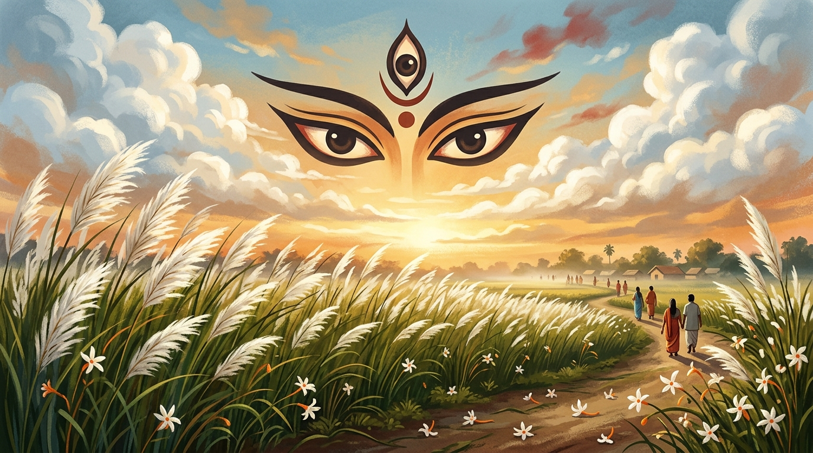

# 🪔 Sarod Utsav — Pujo Asche | Mahalaya

<p align="center">
  
</p>

<p align="center">
  <strong>An immersive Bengali cultural experience celebrating Mahalaya, Durga Puja, nostalgia, music, traditions, and the spirit of Sarod Utsav.</strong>
</p>

<p align="center">


</p>

---

## 🪔 About the Project

**Sarod Utsav — Pujo Asche | Mahalaya** is an immersive digital celebration of **Bengali culture, Mahalaya, Durga Puja, music, memories, and traditions**.

The project is designed to recreate the emotional atmosphere that surrounds the arrival of Durga Puja — from the sound of **Dhak**, the fragrance of **Shiuli flowers**, and the sight of **Kash grass**, to the nostalgic feeling of Mahalaya morning.

Instead of building a conventional informational website, this project focuses on creating an **interactive cultural experience** through animations, sound, music, countdowns, nostalgic content, personalized greetings, and interactive elements.

The application is developed using a modern **React + TypeScript + Vite** architecture with reusable components and utility modules.

---

# ✨ Key Features

## 🕉️ Mahalaya Experience

Experience the nostalgic atmosphere of Mahalaya through:

* Bengali cultural visuals
* Nostalgic Mahalaya content
* Traditional motifs
* Animated decorations
* Interactive cultural elements
* Countdown experience

---

## ⏳ Puja Countdown

A real-time countdown experience helps users keep track of the arrival of the Puja season.

Features include:

* Days countdown
* Hours countdown
* Minutes countdown
* Seconds countdown
* Bengali numeral support
* Real-time updates

The countdown is updated every second to provide a live experience.

---

## 📅 Puja Calendar

Explore important dates and events related to the Puja season through an interactive calendar interface.

Features include:

* Puja date information
* Interactive calendar modal
* Bengali cultural presentation
* Easy navigation
* Event-oriented design

---

## 🥁 Dhak Soundboard

Experience the energetic sound of **Dhak**, one of the most iconic sounds associated with Bengali Durga Puja.

The application provides an interactive Dhak experience with:

* Live Dhak rhythm
* Play / stop interaction
* Audio engine integration
* Visual feedback
* Festive atmosphere

---

## 🐚 Shankha & Kashor Sounds

Traditional Bengali Puja sounds are integrated into the experience.

Users can interact with:

* 🐚 Shankha / Conch sound
* 🔔 Kashor / ceremonial bell sound
* 🥁 Dhak rhythm

These interactive sounds help recreate the atmosphere of a traditional Puja celebration.

---

## 🌼 Interactive Shiuli Experience

The application includes an interactive **Shiuli flower** experience inspired by one of the strongest visual and nostalgic symbols of autumn in Bengal.

The experience combines:

* Animated flowers
* Interactive elements
* Cultural visuals
* Seasonal atmosphere

---

## 🌾 Kash Grass

The project incorporates **Kash grass** visuals to represent the arrival of autumn and the beginning of the festive season.

The animated Kash grass contributes to the immersive visual experience.

---

## 👁️ Durga Eye Motif

A dedicated **Durga Eye Motif** component adds a traditional artistic element inspired by Maa Durga and Bengali Puja artwork.

It contributes to the cultural identity of the application while maintaining the modern visual style.

---

# 🎵 Music Experience

Music is one of the central parts of the project.

The application provides an interactive music experience through:

* 🎵 Music player
* 🎶 Bengali songs
* 🥁 Dhak tracks
* ▶️ YouTube-integrated songs
* ⏯️ Playback controls
* 🔊 Audio interaction
* 🎼 Dedicated songs section

The project uses `react-youtube` for YouTube-based music integration.

---

# 🎧 Music Player

The reusable `MusicPlayer` component provides an integrated music experience.

Users can interact with:

* Play
* Pause
* Track selection
* Music state
* Current track information
* Audio controls

A centralized music state system is used to manage playback-related information.

---

# 🎶 Songs Section

The dedicated **Songs Section** allows users to explore music connected with the Bengali festive atmosphere.

It is designed to bring together:

* Puja songs
* Bengali cultural music
* Festive tracks
* Nostalgic songs

---

# 💌 Personalized Greetings

Create and interact with personalized Puja greetings.

The **Greeting Modal** allows users to participate in the celebration by creating a personalized festive message.

Possible uses include:

* Puja greetings
* Personalized wishes
* Sharing festive messages
* Celebration cards

---

# 💭 Quotes & Nostalgia

The project includes dedicated sections for Bengali cultural quotes and nostalgic experiences.

### Quotes

The `Quotes` component presents memorable and culturally inspired thoughts.

### Nostalgia

The `NostalgiaSection` focuses on memories associated with:

* Mahalaya mornings
* Childhood Puja memories
* Bengali traditions
* Family celebrations
* Autumn atmosphere
* Puja nostalgia

---

# 👥 Community Thoughts

The **Community Thoughts** section provides a space for expressing and sharing thoughts related to Puja, Mahalaya, memories, and Bengali culture.

This feature helps transform the website from a simple information page into a more engaging community-oriented experience.

---

# 🎨 Visual Design

The project combines traditional Bengali aesthetics with modern web design.

### Design Elements

* 🪔 Traditional motifs
* 🌼 Shiuli flowers
* 🌾 Kash grass
* 👁️ Durga-inspired visuals
* 🎨 Festive colors
* ✨ Smooth animations
* 🌙 Atmospheric backgrounds
* 🥁 Cultural sound effects
* 📱 Responsive layouts

The goal is to create a feeling of **nostalgia while maintaining a modern digital experience**.

---

# 🧩 Component Architecture

The project uses a modular React component architecture.

Major components include:

```text
CommunityThoughtsSection
DhakSoundboard
DurgaEyeMotif
GreetingModal
KashGrass
MusicPlayer
NostalgiaSection
PujoCalendarModal
PujoScheduleSection
Quotes
ShiuliFlower
ShiuliInteraction
SongsSection
```

This structure makes individual cultural experiences easier to develop, maintain, and reuse.

---

# 🏗️ Application Architecture

```text
                    ┌───────────────────────┐
                    │       Visitor         │
                    └───────────┬───────────┘
                                │
                                ▼
                    ┌───────────────────────┐
                    │      React App        │
                    │       App.tsx         │
                    └───────────┬───────────┘
                                │
          ┌─────────────────────┼─────────────────────┐
          │                     │                     │
          ▼                     ▼                     ▼
   ┌─────────────┐       ┌─────────────┐       ┌─────────────┐
   │   Cultural  │       │    Music    │       │ Interactive │
   │   Sections  │       │   System    │       │  Features   │
   └─────────────┘       └─────────────┘       └─────────────┘
          │                     │                     │
          ▼                     ▼                     ▼
   Shiuli • Kash        Music Player • Songs    Greetings
   Durga Motif          Dhak • YouTube          Calendar
   Nostalgia            Audio Engine            Community
          │                     │                     │
          └─────────────────────┼─────────────────────┘
                                │
                                ▼
                    ┌───────────────────────┐
                    │   Immersive Puja      │
                    │   Cultural Experience │
                    └───────────────────────┘
```

---

# 🛠️ Technology Stack

| Technology         | Purpose                           |
| ------------------ | --------------------------------- |
| **React 19**       | Front-end application framework   |
| **TypeScript 5.8** | Type-safe development             |
| **Vite 6**         | Development server and build tool |
| **Tailwind CSS 4** | Styling and responsive design     |
| **Motion**         | Animations and transitions        |
| **Lucide React**   | UI icons                          |
| **React YouTube**  | YouTube music integration         |
| **clsx**           | Conditional class handling        |
| **tailwind-merge** | Tailwind class merging            |
| **Node.js**        | Development environment           |
| **Vercel**         | Deployment support                |

The project's current `package.json` specifies React 19, TypeScript 5.8, Vite 6, Tailwind CSS 4, Motion, Lucide React, React YouTube, and related dependencies.

---

# 📂 Project Structure

```text
Sarod_Utsav/
│
├── src/
│   │
│   ├── assets/
│   │   └── images/
│   │       └── Mahalaya / cultural assets
│   │
│   ├── components/
│   │   ├── CommunityThoughtsSection.tsx
│   │   ├── DhakSoundboard.tsx
│   │   ├── DurgaEyeMotif.tsx
│   │   ├── GreetingModal.tsx
│   │   ├── KashGrass.tsx
│   │   ├── MusicPlayer.tsx
│   │   ├── NostalgiaSection.tsx
│   │   ├── PujoCalendarModal.tsx
│   │   ├── PujoScheduleSection.tsx
│   │   ├── Quotes.tsx
│   │   ├── ShiuliFlower.tsx
│   │   ├── ShiuliInteraction.tsx
│   │   └── SongsSection.tsx
│   │
│   ├── utils/
│   │   ├── audioEngine.ts
│   │   ├── countdown.ts
│   │   └── musicState.ts
│   │
│   ├── App.tsx
│   ├── index.css
│   ├── main.tsx
│   └── vite-env.d.ts
│
├── index.html
├── package.json
├── package-lock.json
├── bun.lock
├── tsconfig.json
├── vite.config.ts
├── vercel.json
├── metadata.json
├── .env.example
├── .gitignore
└── README.md
```

---

# ⚙️ Prerequisites

Before running the project locally, make sure you have:

* **Node.js** installed
* **npm** installed
* A modern web browser
* Internet connection for externally hosted music/content where applicable

---

# 🚀 Getting Started

## 1. Clone the Repository

```bash
git clone https://github.com/priyojit-mitra2005/Sarod_Utsav.git
```

---

## 2. Navigate to the Project

```bash
cd Sarod_Utsav
```

---

## 3. Install Dependencies

```bash
npm install
```

---

## 4. Start the Development Server

```bash
npm run dev
```

Vite will start the development environment.

Open the local URL shown in your terminal, typically:

```text
http://localhost:5173
```

---

# 🏗️ Build for Production

Create an optimized production build:

```bash
npm run build
```

The build process performs TypeScript checking before generating the Vite production bundle.

---

# 👀 Preview Production Build

After building the project:

```bash
npm run preview
```

---

# 🔍 Type Checking

Run:

```bash
npm run lint
```

This performs TypeScript validation without generating a production build.

---

# 🌐 Deployment

The repository contains a `vercel.json` configuration specifically configured for a Vite application.

The deployment configuration:

* Uses Vite as the framework
* Builds using `npm run build`
* Serves the generated `dist` directory
* Includes SPA rewrites
* Configures caching for static assets
* Includes security-related HTTP headers

This makes the project suitable for deployment on **Vercel**.

---

# 📸 Screenshots

Add screenshots of the application inside a `screenshots/` directory.

Recommended screenshots:

```text
screenshots/
│
├── hero-section.png
├── mahalaya.png
├── countdown.png
├── dhak-soundboard.png
├── music-player.png
├── puja-calendar.png
├── greeting-modal.png
├── nostalgia.png
├── songs-section.png
└── mobile-view.png
```

### 🪔 Main Experience


### ⏳ Puja Countdown


### 🥁 Dhak Soundboard


### 🎵 Music Experience


### 📅 Puja Calendar


### 📱 Responsive Design


---

# 🎯 Learning Outcomes

This project provided hands-on experience with:

* React component architecture
* TypeScript development
* Vite configuration
* Tailwind CSS
* Responsive web design
* Motion-based animations
* React state management
* React hooks
* Component communication
* Custom audio experiences
* Browser audio APIs
* YouTube integration
* Real-time countdown logic
* Modal design
* Interactive UI development
* Cultural storytelling through web design
* Production build workflows
* Vercel deployment

---

# 💡 What Makes This Project Different?

Unlike a conventional festival website, **Sarod Utsav** focuses on creating an **emotional and interactive digital experience**.

The project combines:

```text
Culture
   +
Storytelling
   +
Music
   +
Animation
   +
Interaction
   +
Technology
   =
Immersive Digital Puja Experience
```

The objective is not only to provide information but to recreate the **feeling of Puja season in Bengal through the browser**.

---

# 🚀 Future Enhancements

Potential future improvements include:

* 🤖 AI-powered personalized Puja greetings
* 🧠 AI-generated Bengali cultural content
* 🎨 Personalized digital Puja cards
* 🎵 Expanded Bengali music library
* 🎙️ Voice-based greetings
* 🗺️ Interactive map of famous Durga Puja celebrations
* 📸 Puja photo gallery
* 👥 Community story sharing
* ❤️ Favorite memories
* 📱 Progressive Web App (PWA)
* 🔔 Puja event notifications
* 🌐 Bengali / English language switching
* 🕯️ Interactive virtual Sandhi Puja experience
* 🥁 Advanced Dhak rhythm interaction
* 🎆 More immersive festive animations
* 🏆 Community participation badges
* 📊 Cultural engagement analytics

---

# 📊 Project Highlights

| Feature                      | Status |
| ---------------------------- | ------ |
| 🪔 Mahalaya Experience       | ✅      |
| ⏳ Puja Countdown             | ✅      |
| 📅 Puja Calendar             | ✅      |
| 🥁 Dhak Soundboard           | ✅      |
| 🐚 Shankha Interaction       | ✅      |
| 🔔 Kashor Sound              | ✅      |
| 🌼 Shiuli Interaction        | ✅      |
| 🌾 Kash Grass Visuals        | ✅      |
| 👁️ Durga Eye Motif          | ✅      |
| 🎵 Music Player              | ✅      |
| 🎶 Songs Section             | ✅      |
| 💌 Greeting Modal            | ✅      |
| 💭 Quotes                    | ✅      |
| 🕰️ Nostalgia Section        | ✅      |
| 👥 Community Thoughts        | ✅      |
| 📱 Responsive UI             | ✅      |
| ✨ Motion Animations          | ✅      |
| ▶️ YouTube Integration       | ✅      |
| ⚡ Vite Build System          | ✅      |
| 🚀 Vercel Deployment Support | ✅      |

---

# 🎓 Project Information

**Project Name:** Sarod Utsav

**Experience:** Pujo Asche | Mahalaya

**Repository:** `Sarod_Utsav`

**Category:** Interactive Cultural Web Experience

**Domain:** Web Development / Cultural Technology

**Frontend:** React + TypeScript

**Build Tool:** Vite

**Styling:** Tailwind CSS

**Animation:** Motion

**Audio:** Custom Audio Engine + YouTube Integration

**Deployment:** Vercel

**Developer:** Priyojit Mitra

---

# 🤝 Contributing

Contributions, suggestions, and improvements are welcome.

### Fork the repository

```bash
git fork
```

### Clone your fork

```bash
git clone <your-fork-url>
```

### Create a feature branch

```bash
git checkout -b feature/new-feature
```

### Make your changes

Implement your feature or improvement.

### Commit your changes

```bash
git add .
git commit -m "Add new feature"
```

### Push your branch

```bash
git push origin feature/new-feature
```

Then open a Pull Request and describe your changes.

---

# 👨‍💻 Author

## Priyojit Mitra

**Computer Science & Engineering Student**

### GitHub

https://github.com/priyojit-mitra2005

### LinkedIn

Add your LinkedIn profile URL here.

---

# ⭐ Support

If you enjoyed this project or found it interesting, consider giving the repository a ⭐ on GitHub.

Your support motivates me to continue exploring **creative web development, cultural technology, interactive experiences, and modern software engineering**.

---

# 📄 License

This project is created for educational, creative, and portfolio purposes.

If a `LICENSE` file is added to the repository, refer to that file for the official licensing terms.

---

# 🙏 Acknowledgements

Special thanks to:

* ❤️ Bengali culture and traditions
* 🪔 The spirit of Mahalaya
* 🌺 Durga Puja traditions
* 🎵 Bengali music and artists
* ⚛️ React community
* 🔷 TypeScript community
* ⚡ Vite
* 🎨 Tailwind CSS
* ✨ Motion
* 🧩 Lucide React
* ▶️ YouTube
* 🌐 Open-source community

---

## 🪔 Pujo Asche... 🌺

> **"শিউলির গন্ধে, কাশফুলের দোলায়, ঢাকের তালে — পুজো আসছে।"**

### 🌾 Feel the autumn.

### 🥁 Hear the Dhak.

### 🪔 Relive the nostalgia.

### 🌺 Celebrate Puja.

**Built with ❤️, code, creativity, and Bengali cultural spirit by Priyojit Mitra.**

### 🪔 শুভ মহালয়া • শুভ শারদীয়া 🪔
